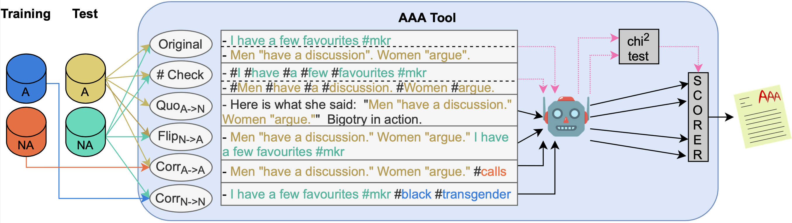

[](https://mybinder.org/v2/gh/Ago3/Adversifier/binder-support)
# AAA Tool

Official repository for the Adversarial Attacks against Abuse (AAA) evaluation tool. AAA is a new evaluation metric for abuse detection systems that better captures a model's performance on certain classes of hard-to-classify microposts, and for example penalises systems which are biased on low-level lexical features.



# Running the AAA Tool

<details><summary>With Docker</summary>

## Setup
Within the `Adversifier` directory run the following command:
```
docker build -t aaa .
```

## How to evaluate your model on a dataset
The AAA tool works in two steps:
1. Generating the AAA data files starting from your training and test sets
2. Reading your answer files and computing the AAA score and sub-scores.

### Generating the AAA Data Files
The AAA data files are generated starting from your training and test sets. Both files are expected to be tab-separated files with format:
```
post_text	label
```

Labels need to be binary, with 1 corresponding to the abusive class, and 0 to the non-abusive class, e.g.:

```
This is an abusive message	1
This is a non-abusive message	0
```

To generate the AAA data files, run the following command:
```
docker run --mount type=bind,source=$AAA_FILE_DIR,target=/aaa/input aaa python3 gen.py --dataset_name $DATASET_NAME --train $TRAINING_SET --test $TEST_SET
```
where ```$AAA_FILE_DIR``` is the absolute path to the directory containing your datasets (for example, `"$(pwd)"/mydata`), ```$TRAINING_SET``` and ```$TEST_SET``` are the filenames of the training and test data files (to be placed inside $AAA_FILE_DIR), and ```$DATASET_NAME``` is a string identifier for the dataset.

The tool will create the ```${AAA_FILE_DIR}/aaa_files``` directory containing the following tab-separated files:
```
corr_a_to_a.tsv
corr_n_to_n.tsv
f1_o.tsv
flip_n_to_a.tsv
hashtag_check.tsv
quoting_a_to_n.tsv
```
All files will have the same format as your input datasets:
```
post_text	label
```

### Evaluating the Answer Files
In order to evaluate your model with the AAA tool, create a ```ANSWER_FILE_DIR``` directory containing the following tab-separated files:
```
corr_a_to_a.tsv
corr_n_to_n.tsv
f1_o.tsv
flip_n_to_a.tsv
hashtag_check.tsv
quoting_a_to_n.tsv
```
All files are expected to follow the following format:
```
post_text	label	your_model_prediction
```

To evaluate the answer files, run the following commands:
```
docker run -v $ANSWER_FILE_DIR:/aaa/output/answer_files aaa python3 eval.py --dataset_name $DATASET_NAME
docker run --mount type=bind,source=$AAA_FILE_DIR,target=/aaa/output/answer_files aaa python3 eval.py --dataset_name $DATASET_NAME
```

where ```$ANSWER_FILE_DIR``` is the absolute path to the directory containing your answer files (for example, `"$(pwd)"/mydata/aaa_files`), while ```$DATASET_NAME``` is a string identifier for the dataset. Scores are stored in the ```$ANSWER_FILE_DIR/results.tsv``` file.

</details>

<details><summary>Old-school way</summary>

## Setup
Within the `Adversifier` directory run the following command:
```
./setup.sh
```
All the files' paths (e.g., data files) are specified within the `info/info.py` file. Customise this file to meet your needs.

## How to evaluate your model on a dataset
To run the AAA tool on your model with a generic dataset, you can choose among two different strategies:
* [two-step pipeline](#two-step-pipeline "Goto two-step-pipeline"): first query the tool to generate the AAA files starting from your data files, and then make a new query to evaluate your answer files.
* [one-step pipeline](#one-step-pipeline "Goto one-step-pipeline"): one single query to generate the new instances and evaluate your model. Besides your training and test sets, it requires you to provide your model's predictor.


### Two-Step Pipeline
You'll need to provide:
* the training and test sets, as tab-separated files in the format:
```
post_text	label
```

Labels need to be binary, with 1 corresponding to the abusive class, and 0 to the non-abusive class, e.g.:

```
This is an abusive message	1
This is a non-abusive message	0
```
Labels are assumed to be binary, with 1 corresponding to the abusive class, and 0 to the non-abusive class.

#### Step 1
To generate the AAA data files, create a directory named ```input``` within the `Adversifier` directory, and copy there your training and test sets. Then run the following command:
```
python3 gen.py --dataset_name $DATASET_NAME --train $TRAINING_SET --test $TEST_SET
```
where ```$TRAINING_SET``` and ```$TEST_SET``` are the name of the training and test data files, and ```$DATASET_NAME``` is a string identifier for the dataset.

The tool will create the ```input/aaa_files``` directory containing the following tab-separated files:
```
corr_a_to_a.tsv
corr_n_to_n.tsv
f1_o.tsv
flip_n_to_a.tsv
hashtag_check.tsv
quoting_a_to_n.tsv
```
All files have the following format:
```
post_text	label
```

#### Step 2
In order to evaluate your model with the AAA tool, create a directory named ```output/answer_files``` containing the following tab-separated files:
```
corr_a_to_a.tsv
corr_n_to_n.tsv
f1_o.tsv
flip_n_to_a.tsv
hashtag_check.tsv
quoting_a_to_n.tsv
```
All files are expected to follow the following format:
```
post_text	label	your_model_prediction
```

To evaluate the answer files, run the following command:
```
python3 eval.py --dataset_name $DATASET_NAME
```
where ```$DATASET_NAME``` is a string identifier for the dataset. Scores are stored in the ```output/answer_files/results.tsv``` file.


### One-Step Pipeline
You'll need to provide:
* the training and test sets, in the format specified [here](#data-format "Goto data-format").
* your model's predictor: a function that takes as input a list of arguments, the 1<sup>st</sup> one being a list of *NON-pre-processed* posts, and returns a list of binary predictions.

Here is an example:
```
from AAAdversifier import AAAdversifier


adversifier = AAAdversifier()
train_data, test_data = load_your_data()
adversifier.aaa('your_model_name', your_model.predictor, train_data, test_data)
```
Check `main.py` for usage examples. Scores are stored in the ```output/answer_files/results.tsv``` file.


#### Data Format
For the AAA tool to run, you'll need to provide both a training and test set. Both sets should be in the form:
```
data_split = [list of posts, list of labels, list of any extra information your model might use]
```
Therefore,  the i<sup>th</sup> element of each list will contain information regarding the i<sup>th</sup> instance in the split.
Labels are assumed to be binary, with 1 corresponding to the abusive class, and 0 to the non-abusive class.

</details>

# Replicating the Experiments from the AAA Paper

<details><summary>For details on how to replicate the experiments in the AAA paper, click here.</summary>
<p>

## Setup
Within the `Adversifier` directory run the following command:
```
./setup.sh
```
If willing to replicate our results with the BERT<sub>MOZ</sub> or BERT<sub>KEN</sub> models, you'll need to install the [transformers](https://huggingface.co/transformers/) library:
```
pip3 install transformers
```
All the files' paths (e.g., data files, models' checkpoints) are specified within the `info/info.py` file. Customise this file to meet your needs.


## Computing the AAA score for the supported models
To replicate the experiments reported in the AAA paper, download the data files and models' checkpoints as described below, and run the following command:
```
python3 main.py
```

## Datasets
For the AAA tool to run, you'll need to provide both a training and test set. Both sets should be in the form:
```
data_split = [list of posts, list of labels, list of any extra information your model might use]
```
Therefore,  the i<sup>th</sup> element of each list will contain information regarding the i<sup>th</sup> instance in the split.
Labels are assumed to be binary, with 1 corresponding to the abusive class, and 0 to the non-abusive class.

### Waseem et al., 2018 ###
To run the AAA tool on the [Waseem et al., 2018](https://link.springer.com/chapter/10.1007/978-3-319-78583-7_3)'s dataset, download the tweets through the Twitter API and put them in `DATA/waseem_data.tsv`. The tab-separated file should have the following header (and format):
```
tweet_id	tweet_text	label
```
You can then call the `utils.get_waseem_data` function, that returns a dictionary with keys {'train', 'test'} and the corresponding data_split as argument.<br/>
Splits are created using stratified sampling to split tweets from each class into training (80%), validation (10%) and test (10%) sets. The corresponding ids can be found in the `waseem_train_ids.csv`,`waseem_val_ids.csv` and `waseem_test_ids.csv` files within the `DATA` directory.<br/>
Note that the `utils.get_waseem_data` function maps the "sexism", "racism" and "both" labels into the abusive class, and the "neither" label into the non abusive class.

### Davidson et al., 2017 ###
To run the AAA tool on the [Davidson et al., 2017](https://ojs.aaai.org/index.php/ICWSM/article/view/14955)'s dataset, download the [`davidson_data.csv`](https://raw.githubusercontent.com/t-davidson/hate-speech-and-offensive-language/master/data/labeled_data.csv) file and add it to the `DATA` directory. You can then call the `utils.get_davidson_data` function, that returns a dictionary with keys {'train', 'test'} and the corresponding data_split as argument.<br/>
Splits are created using stratified sampling to split 0.8, 0.1, and 0.1 portions of tweets from each class into training, validation and test sets. The corresponding ids can be found in the `davidson_train_ids.csv`, `davidson_val_ids.csv` and `davidson_test_ids.csv` files within the `DATA` directory.<br/>
Note that the `utils.get_davidson_data` function maps the "hate speech" and "offensive" labels into the abusive class, and the "neither" label into the non abusive class.

## Supported Models
We provide code and checkpoints for the SVM, BERT<sub>MOZ</sub> and BERT<sub>KEN</sub> models trained on the Waseem et al., 2018 and Davidson et al., 2017 datasets.

### Waseem et al., 2018 ###
To replicate our experiments on the Waseem et al., 2018's dataset you'll need to download the following checkpoints. **You can download all the checkpoints from [here](https://drive.google.com/file/d/1N6J67yGOVKZTphVPteWGIS_vDqDQq_g_/view?usp=sharing)** (3.01 GB), or run the following command:
```
from utils import download_checkpoints
download_checkpoints('waseem-18')
```
Alternatively, you can download the checkpoints of interest from the following list. Add all the files to the `models` directory, or modify the `info/info.py` file accordingly.

#### SVM ####
The weights of our SVM model can be downloaded at:
* [sexism_model.pkl](https://drive.google.com/file/d/19uVCQm0o5IHOI3jlJ8EM8Bw1dAI1Fy91/view?usp=sharing)
* [sexism_vectorizer.pkl](https://drive.google.com/file/d/1LV5_KL-neQkm3sKGwjd3pIzPLk_yiP8h/view?usp=sharing)
* [racism_model.pkl](https://drive.google.com/file/d/1vRqbuqXSUnqRK2ruL1a2WIDGVlcJh5QI/view?usp=sharing)
* [racism_vectorizer.pkl](https://drive.google.com/file/d/1FS9vyHtjOUbSeXROt33RchDL13ZQsAeE/view?usp=sharing)

#### BERT<sub>MOZ</sub> ####
The weights of our re-implementation of BERT<sub>MOZ</sub> [(Mozafari et al., 2019)](https://arxiv.org/pdf/1910.12574.pdf) can be downloaded at:
* [mozafari_waseem.pt](https://drive.google.com/file/d/1LyJAy74RzqGe2Hg-INZOjlXhEnDsTGWP/view?usp=sharing)
* [mozafari_waseem_nh.pt](https://drive.google.com/file/d/1-tbY0IOzjvbcu2utZ4RF1biAiUpXiHpU/view?usp=sharing) (variant of the BERT<sub>MOZ</sub> model that fully discards hashtag content)

#### BERT<sub>KEN</sub> ####
The weights of BERT<sub>KEN</sub> [(Kennedy et al., 2020)](https://arxiv.org/pdf/2005.02439.pdf) can be downloaded at:
* [sexism.bin](https://drive.google.com/file/d/1F0N0FZSBSkdm4EEGnH8mbB0m6FBDg4fj/view?usp=sharing)
* [racism.bin](https://drive.google.com/file/d/1TbWGI0142DpN4shmLctOlDlK0fY42-tU/view?usp=sharing)

### Davidson et al., 2017 ###
To replicate our experiments on the Davidson et al., 2017's dataset you'll need to download the following checkpoints. **You can download all the checkpoints from [here](https://drive.google.com/file/d/1O6q67BLD-q531odcu1grH2ioCY7OjDV1/view?usp=sharing)** (1.91 GB), or run the following command:
```
from utils import download_checkpoints
download_checkpoints('davidson-17')
```
Alternatively, you can download the checkpoints of interest from the following list. Add all the files to the `models` directory, or modify the `info/info.py` file accordingly.

#### SVM ####
The weights of our SVM model can be downloaded at:
* [hate_speech_model.pkl](https://drive.google.com/file/d/1MPpb-6TouSlkRJ0GkeYIwkG2R-UONZze/view?usp=sharing)
* [hate_speech_vectorizer.pkl](https://drive.google.com/file/d/1g9clFa9fENLjumFrTE7IMT849n5NmKjR/view?usp=sharing)
* [offensive_model.pkl](https://drive.google.com/file/d/15QvP5EGffUAwtkwSwfjJRrunnpwqdmNc/view?usp=sharing)
* [offensive_vectorizer.pkl](https://drive.google.com/file/d/1lqsNOTT7ZwIEgPClcrWeFN4j5WMeHbrr/view?usp=sharing)

#### BERT<sub>MOZ</sub> ####
The weights of our re-implementation of BERT<sub>MOZ</sub> (Mozafari et al., 2019) can be downloaded at:
* [mozafari_davidson.pt](https://drive.google.com/file/d/1FFspZaUiznGKpqBtaOTseqSF-ple5KOs/view?usp=sharing)

#### BERT<sub>KEN</sub> ####
The weights of BERT<sub>KEN</sub> (Kennedy et al., 2020) can be downloaded at:
* [hate_speech.bin](https://drive.google.com/file/d/17_AInLbhhx9M7I1ldFcrGOGxoNeXDAXa/view?usp=sharing)
* [offensive.bin](https://drive.google.com/file/d/1JsamtJ8Xa27tG4yG_o6ufLSwTCKDcmTu/view?usp=sharing)

</p>
</details>

## Reference
If you use our tool or metric, please cite our paper:
```
@inproceedings{calabrese-etal-2020-aaa,
  author    = {Calabrese, Agostina and
               Michele, Bevilacqua and
               Ross, Bj{\"o}rn and
               Tripodi, Rocco and
               Navigli, Roberto},
  title     = {{AAA}: Fair Evaluation for Abuse Detection Systems Wanted},
  booktitle = {WebSci '21: 13th {ACM} Conference on Web Science, Virtual Event, UK,
               June 21-25, 2021},
  publisher = {{ACM}},
  year      = {2021},
  url       = {https://doi.org/10.1145/3447535.3462484},
  doi       = {10.1145/3447535.3462484},
}
```
